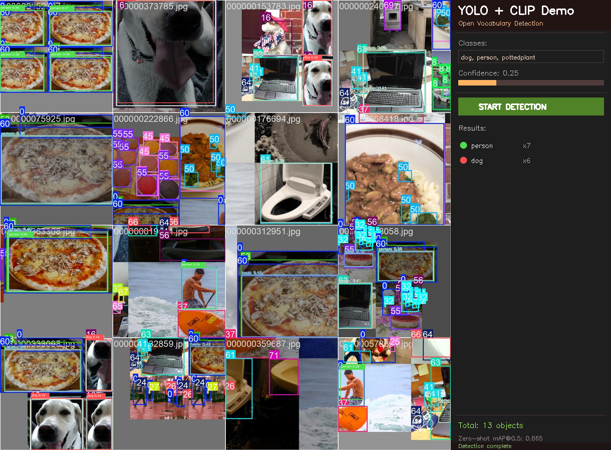

# 🎯 YOLO + CLIP Open Vocabulary Detection

A lightweight desktop application for open-vocabulary object detection powered by YOLO26m and CLIP ViT-L/14@336px.



## ✨ Features

- **🔍 Open Vocabulary** — Detect anything you can describe in text, no retraining needed
- 🖥️ **Desktop GUI** — Drag & drop images, no coding required
- ⚡ **Fast** — Runs on GPU (RTX 4090 recommended), real-time detection
- 🎚️ **Adjustable** — Confidence threshold slider for fine-tuning results
- 💾 **Export** — Save annotated images with bounding boxes

## 📦 Quick Start

```bash
# 1. Clone the repo
git clone https://github.com/Freakz2z/YOLO-CLIP_OpenVocDetection.git
cd YOLO-CLIP_OpenVocDetection

# 2. Install dependencies
pip install -r requirements.txt

# 3. Run! (YOLO and CLIP models auto-download on first run)
python demo_app.py
```

## 🖼️ Usage

1. **Load image** — Drag & drop or double-click to browse
2. **Enter classes** — Type any categories (comma-separated), e.g. `person, dog, car, bicycle`
3. **Adjust threshold** — Lower = more detections, Higher = fewer but more confident
4. **Click Detect** — See results with bounding boxes
5. **Save** — Export annotated image

### Example Prompts

- `person, dog, cat, car, bicycle, chair` — everyday objects
- `aeroplane, boat, train, bus` — vehicles
- VOC 20 classes: aeroplane, bicycle, bird, boat, bottle, bus, car, cat, chair, cow, diningtable, dog, horse, motorbike, person, pottedplant, sheep, sofa, train, tvmonitor

**YOLO weights:** The app auto-downloads a pretrained YOLO model on first run. Works with any Ultralytics model (yolov8n/m/l/x, yolov10n/m/l, etc.).

## 🔬 How It Works

Two-stage pipeline:

```
Image → YOLO26m (candidate boxes) → CLIP ViT-L/14@336px (zero-shot classification)
```

1. **YOLO** localizes all potential objects
2. **CLIP** classifies each region by text similarity
3. **Combined confidence** = YOLO_conf × CLIP_conf

## 📊 Benchmark (VOC 2007)

| Method | mAP@0.5 | Notes |
|--------|:-------:|:------|
| YOLO + CLIP (zero-shot, ViT-L/14@336px) | 0.665 | No training |
| YOLO26m fine-tuned (56 epochs) | 0.678 | Trained on VOC |
| **YOLO26m fine-tuned (100 epochs)** | **0.724** | Trained on VOC |
| YOLO-World | 0.635 | Pre-trained |
| Detic | 0.612 | Trained on COCO+LVIS |

## 🗂️ Project Structure

```
.
├── demo_app.py           # Main GUI application
├── requirements.txt      # Python dependencies
├── README.md            # This file
├── LICENSE              # MIT License
└── examples/           # Demo images & screenshots
```

## ⚙️ Requirements & Setup

- Python 3.10+
- CUDA-capable GPU (4GB+ VRAM recommended, but CPU also works)
- Windows / macOS / Linux

> **Note:** The app downloads CLIP models (~891MB for ViT-L/14@336px) on first run.

## 📄 License

MIT License — see [LICENSE](LICENSE)

## 🙏 Acknowledgments

- [Ultralytics YOLO](https://github.com/ultralytics/ultralytics)
- [OpenAI CLIP](https://github.com/openai/CLIP)
- [VOC Dataset](https://host.robots.ox.ac.uk/pascal/VOC/)
